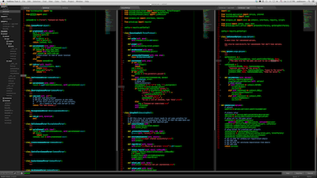

# VimBlackboard

<a href="https://raw.github.com/oubiwann/Theme-VimBlackboard/master/Sublime-VimBlackboard.png">
  
</a>

## About

The syntax highlighting in VimBlackboard is based on Blackboard (as one might
imagine), but with many of the colors changed to resemble the default Vim colors
used on dark terminals in various Linux distros from the late 90s and early
00s.

The widget theme is derived from [Soda Dark] (https://github.com/buymeasoda/soda-theme).

## Installation
Blackboard is a Sublime package. To install it:

1. Make a home for your code and then go there, e.g.:

    ```bash
    mkdir ~/lab/SublimeText
    cd ~/lab/SublimeText
    ```

2. Clone the repo:

    ```bash
    git clone https://github.com/oubiwann/Theme-VimBlackboard.git
    ```

3. Change dir to your Sublime Text 2 Packages directory. You can find that
   directory by selecting "Preferences > Browse Packages ...".
4. From the package directory, link to your checkout:

    ```bash
    ln -s ~/lab/SublimeText/Theme-VimBlackboard/Theme\ -\ VimBlackboard .
    ```

5. Activate the theme by modifying your user preferences to include the
   following:

    ```javascript
    {
      "theme": "VimBlackboard.sublime-theme",
      "color_scheme": "Packages/Theme - VimBlackboard/VimBlackboard.tmTheme"
    }
    ```
6. Tweak futher by adding folder icons and classic tabs:

    ```javascript
    {
      "vimbb_folder_icons": true,
      "vimbb_classic_tabs": true
    }
    ```
If you need help locating your user preferences file, you can find it selecting
"Preferences > Settings - User".
